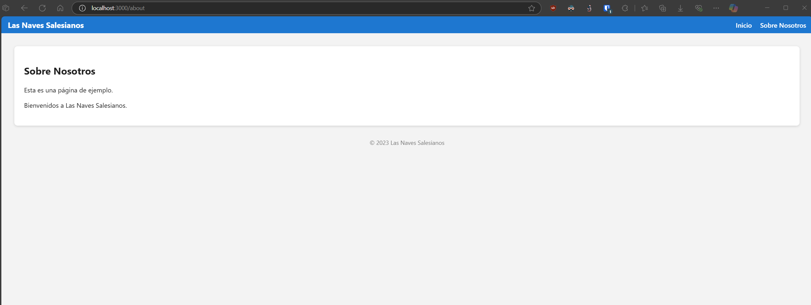

# Tarea Express + Morgan

Este proyecto demuestra cómo crear un servidor en **Node.js** con **Express** y **Morgan**, mostrando logs de diferentes niveles. Incluye:
- **Rutas** con HTML/EJS.
- **Registros** de solicitudes en consola con Morgan.
- **CSS** básico.
- **Manejo** de rutas inexistentes (404).

## Requisitos
- **Node.js** instalado
- **Paquetes** Express, Morgan y ejs (`npm install express morgan ejs`)

## Estructura de Archivos
- **app.js**: Configuración de Express y Morgan
- **views**: Plantillas EJS
- **public/css**: Archivos de estilo
- **readme.md**: Documentación (este archivo)

## Ejecutar la aplicación
```bash
node app.js
```
Rutas disponibles  
/: Página principal (HTML/EJS)  
/about: Página con EJS  
404: Manejo de rutas no válidas  

## Ejemplos de pruebas

### Arranque del servidor
Ejecuta `node app.js` y revisa la terminal:


### Visitar la ruta principal
Abre http://localhost:3000/


### Ruta /about
Abre http://localhost:3000/about


### Ruta inexistente
Abre http://localhost:3000/xx


### Ver registros en la terminal
